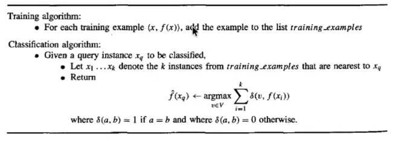
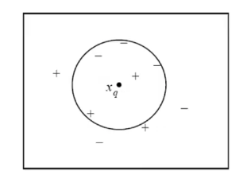
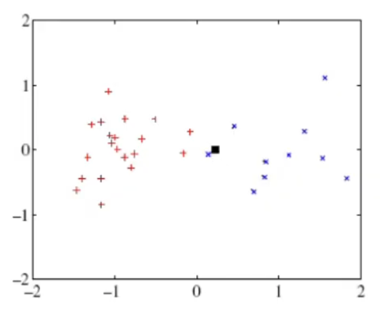
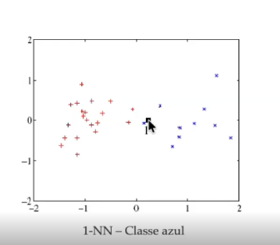
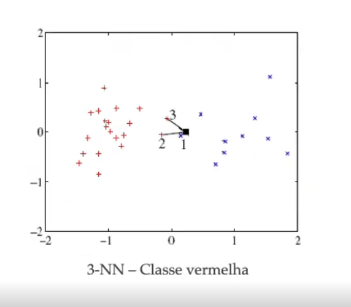
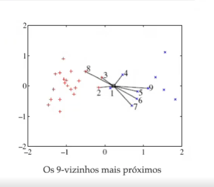
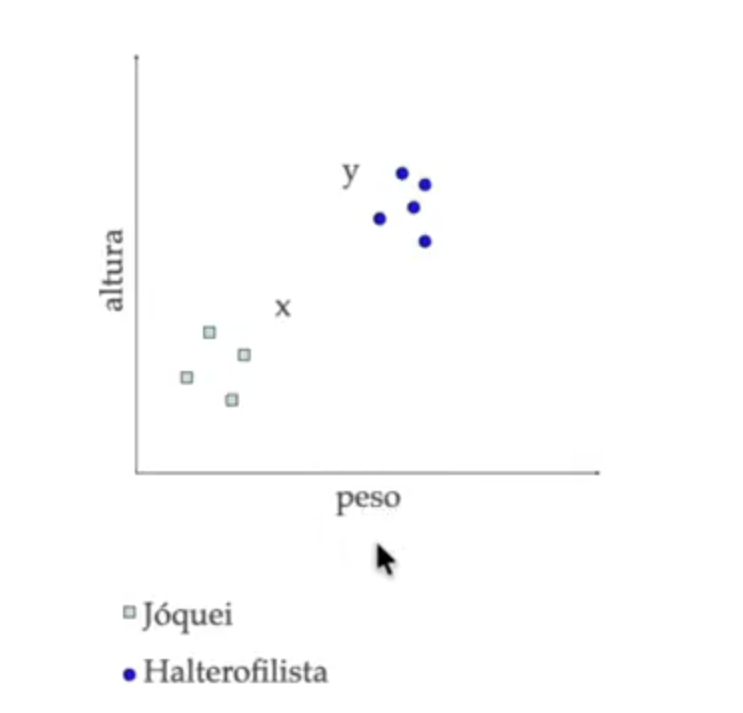
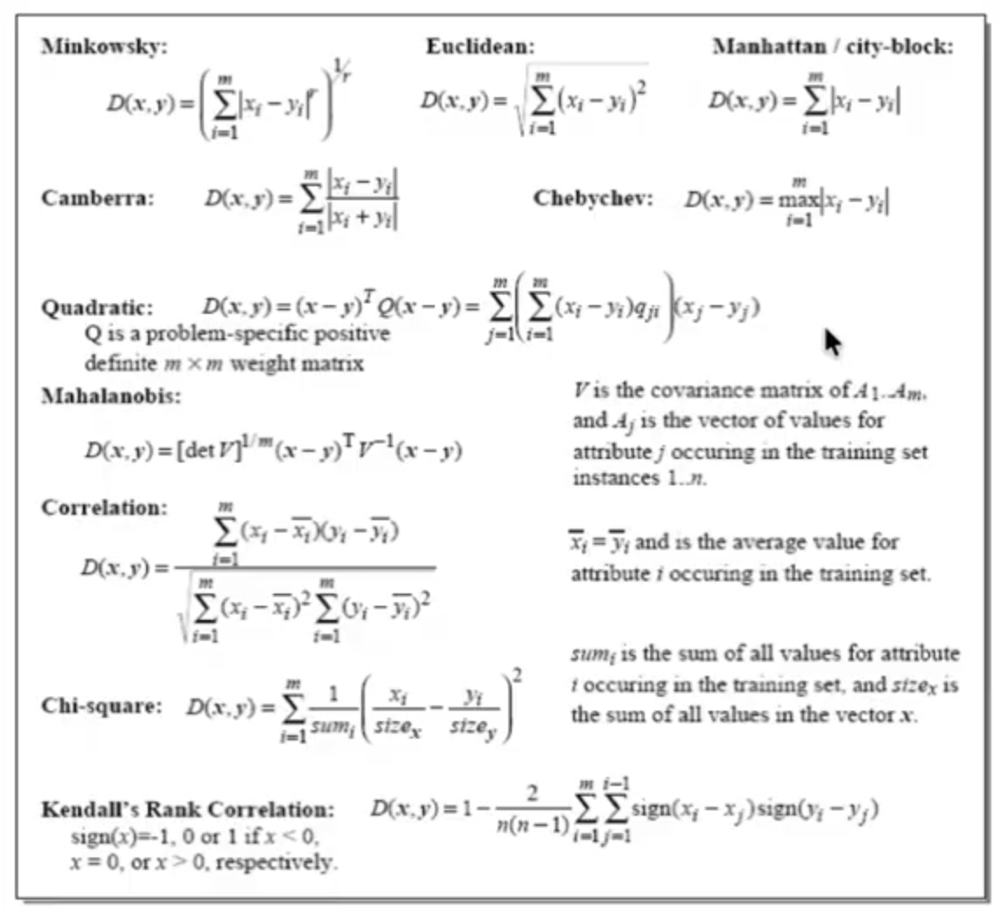

# Aprendizado baseado em instancias

> O processo de aprendizagem nesta familia de algoritmos consiste em armazenar os dados de treino

> Nos algortimos IBL a maquina de aprendizagem constroi uma aproximacao diferente da funcao objetivo para cada novo padrao de consulta

Mas como assim constroi uma aproximacao diferente da funcao objetivo para cada novo padrao ?

Para entender isso vamos relembrar o que e uma funcao objetivo?

Basicamente e uma funcao que mapeia minhas entradas X para uma saida (rotulo conhecido) Y. matematicamente dizendo temos:

$$f(x) = X \rightarrow Y $$

Por exemplo vamos supor que queremos criar um algoritmo para prever precos de imoveis basedo, entao eu criei uma funcao objetivo: $$ Price = f(area)$$

Tenho os dados por exemplo

|Area|Price|
|---|-----|
|50 m²|R$ 300 mil|
|100 m²|R$ 500 mil|
|150 m²|R$ 800 mil|

Para esse tipo de problema e muito comum utilizar um regressor linear. Entao, o que o algoritmo faz e encontrar uma funcao que melhor se ajusta aqueles dados:

$$f(x) = w_{0} + w_{1}x$$

A partir do momento que o meu algortimo consegue encontrar esta funcao o treino termina e nao se gera mais novas funcoes objetivo. Na realidade o que ira ocorrer e quando chegar uma novo dado de area por exemplo: **area = 300 m²**
ele simplesmente executara: $f(300)$ e retornara o resultado a funcao esta pronta ela nao muda.

> Entao neste tipo de problema o que de fato esta ocorrendo e o aprendizado de uma funcao global (aprendizado global)

**Entretanto, nos algoritmos utilizando a ideia de Istance based learning, temos um aprendizado local. Ou seja, ele nao tenta explicar todo o conjunto de dados ele olha apenas para uma pequena vizinhaca do espaco**

Ja no caso de redes neurais por exemplo, uma vez que eu tenho o algortimo muito bem treinado eu posso em teoria descartar o dataset porque ele ja condensou o aprendizado ele aprendeu uma funcao global

**Entao sempre que chegar um novo exemplo (classe) de um conjunto de dados ele vai me gerar uma funcao de objetivo diferente que e basicamente uma aproximacao baseada em uma medida de distancia**

Entao, isso e o que difere estes algoritmos das demais tecnicas dentro do contexo de maquinas de aprendizagem supervisionadas, como por exemplo as Redes Neurais, Arvores de Decisao etc

## k-Nearest Neighbor

O kNN, e um dos algoritmos mais fomosos dentro da familia de algoritmos de aprendizagem baseado em instancias, inicialmente qual e a ideia chave ou melhor dizendo como funciona este algoritmo:

- Como visto a ideia chave dos algortimos **IBL** e apenas armazenar todos os exemplos de treinamento $$\langle x, f(x) \rangle$$

- Entao, dado um valor de consulta $x_{q}$, primeiro localize o exemplo de treinamento mais proximo $x_{i}$, e entao se estima: $$\hat{f}(x_{q}) \leftarrow f(x_{i})$$

ou seja, se estima qual valor de $x_{q}$ mais se aproxima de $x_{i}$ e como isso e possivel se determinar qual e a definicao da classe ou do valor para aquele determinado exemplo $x_{q}$

## Como e localizado o exemplo de treinamento mais proximo

Para se localizar o exemplo mais proximo e feito o seguinte:

**Dado um valor de consulta $x_{q}$, calcula-se a frequencia das classes dos $k$ vizinhos mais proximos .Portanto, o valor da consulta $x_{q}$ que esta sendo feita a "inferencia" vai pertencer a classe de maior frequencia**

Em exemplos mais explicitos suponha que escolhemos k = 5 calculamos as distancias e os 5 vizinhos mais proximos de $x_{q}$ percentecem: 

|Vizinho|Classe|
|---|----|
| 1 | A |
| 2 | B |
| 3 | A |
| 4 | A |
| 5 | B |

Logo, aqui neste caso o novo valor da consulta $x_{q}$ vai pertencer a classe A pois tem 3 ocorrencias.

> Nota: "**k**" e um parametro do algoritmo, que representa o numero de vizinhos sendo um valor arbitrario.Porem, quando estamos trabalhando com problemas de classificacao binaria e bem comum utilizar-se valores impares para reduzir a chance de empate

Estes vizinhos mais proximos sao calculados a partir de medidas de distancia onde a distancia euclidiana e a medida de distancia mais utilizada e tambem comum de se encontrar em frameworks como o sckitlearn

## Calculando a distancia dos vizinhos mais proximos

Dado um padrao x descrito pelo seguinte vetor de caracteristicas: $$ x = (x_{1},x_{2},...,x_{d})$$

- sabendo que $x_{i}$ representa o i-esimo atributo do padrao $x$ a distancia entre dois padroes $x$ e $y$ e dada por: 

$$ d(\mathbf{x}, \mathbf{y}) =
\sqrt{\sum_{i=1}^{d} (x_i - y_i)^2}$$

veja o pseudo-codigo do algoritmo k-NN:

Esse pseudo-codigo vale para quando estamos trabalhando com problemas de classificacao, porem quando estamos trabalhando com problemas de regressao ao invez de utilizar o operador $ \argmax$ utilizamos a media veja:

$$\hat{f}(x_{q}) \leftarrow \frac{\sum^{k}_{i=1}f(x_{i})}{k}$$

## Exemplo

Veja o seguinte exemplo:

- Simbolo "$+$" = classe positiva'
- Simbolo "$-$" = classe negativa'

Quero classificar o $x_{q}$ que e o nosso exemplo de consulta

- se **k = 1** $\rightarrow$ meu $x_{q}$ vai ser da classe positiva pois na imagem o vizinho mais frequente e proximo de $x_{q}$ e "$+$"

- se **k = 5** $\rightarrow$ meu $x_{q}$ vai ser da classe negativa pois meus 5 vizinhos mais proximos serao os que estao dentro do circulo como a maior frequencia e $"-"$ entao ele sera minha classe para k = 5

> O hiperparametro "k" que estou utilizando, vai influenciar diretamente na minha fronteira de decisao

Vamos visualizar este outro exemplo

- Simbolo "+" = classe vermelha'
- Simbolo "x" = classe azul'
- Simbolo "□" = $x_{q}$

1) Primeiro passo: armazeno todos os meus dados de treinamento

2) Segundo passo: calcular as distancias de $x_{q}$ entre todos os exemplos do meu conjunto de treinamento ("cruz e x");

3) Teceiro passo: escolha dos k vizinhos:

- se **k = 1**: o vizinho mais proximo e um "x" entao o meu $x_{q}$ e pertecente a **classe azul**

- se **k = 3**: os vizinho mais proximos sao uma "+" entao o $x_{q}$ pertence a **classe vermelha**

- se **k = 9**: os vizinho mais proximos sao "x" entao o $x_{q}$ pertence a **classe azul**

> A escolha da distancia ou seja, se utiliza-se distancia euclidiancia, distancia de manhatann ou etc vai depender da dimensionalidade dos dados da escala e ate mesmo do formato da vizinhanca. Portanto, percebe-se que o kNN e um algoritmo sensivel a escala dos dados

## Exemplo de kNN executando o calculo manual

Vamos ver um exemplo numerico calculando manualmente, o kNN para entendermos melhor o processo, vamos utilizar um exemplo para encontrar dois padroes sendo:

- padrao x (nova amostra "$x_{q}$");
- padrao y (nova amostra "$x_{q}$");

Neste exemplo cada amostra "x" e "y" possui duas variaveis (altura,peso).

Esses dados sao referentes a atletas de Joquei e Halterofilismo veja a disposicao 2D desses dados:

Veja classifica-se um dado padrao (x,y), associando a ele a classe do elemento de treinamento que possui a menor **distancia** dele.

Logo, se observarmos os dados podemos ver que o padrao "x" esta em **distancia** mais proximos da classe **Joquei** e ja o padrao "y" esta mais proximo em **distancia** da classe **Halterofilisma**. 

Portanto, classificariamos do seguinte modo:

- **"x" (joquei)**;
- **"y" (halterofilista)**;

Mas como calcular isso entao ?

Cada instancia $x_{i}$ e representa pelo par:

$$x_{i}(peso[kg],altura[m])$$

Entao dados, $x=[70;1.63]$ e $y= [83;1.77]$ entao, desejamos descobrir $f(x) = ?$ e $f(y) = ?$

Vamos ver o conjunto de treinamento:

|Joquei|Halterofilista|
|---|----|
| $j_{1}$[50;1.60] | $h_{1}$[91;1.75] |
| $j_{2}$[53;1.65] | $h_{2}$[102;1.85]|
| $j_{3}$[60;1.58] | $h_{3}$[105;1.82] |
| $j_{4}$[62;1.62] | $h_{4}$[103;1.77] |
| --- | $h_{5}$[87;1.73] |

Agora com os dados acumulados que e o primeiro passo, vamos calcular agora a distancia utilizando a **Distancia euclidiana**

Utilizando a equacao da distancia euclidiana:

$$d(\mathbf{x}, \mathbf{y}) =
\sqrt{\sum_{i=1}^{d} (x_i - y_i)^2}$$

Portanto, a distancia entre $x_{i}$ e $j_{1}$:

- $d(x_{i},j_{1}) = (70 - 50)^2 + (1.63 - 1.60)^2$

 $$d = \sqrt{(20)^2 + (0.03)^2}$$

 $$ \therefore d = 20 $$

Agora que calculamos as distancias, vamos organizar as menores distancias entre o padrao $x_{q}$ pois os mais proximos terao caracteristicas mais semelhantes:

Logo, obtêm-se as seguintes distâncias:

| Ordem | Exemplo | Classe | Distância |
|---:|---|---|---:|
| 1 | $j_{4}$ | Jóquei | 8.00 |
| 2 | $j_{3}$ | Jóquei | 10.00 |
| 3 | $j_{2}$ | Jóquei | 17.00 |
| 4 | $h_{5}$ | Halterofilista | 17.00 |
| 5 | $j_{1}$ | Jóquei | 20.00 |
| 6 | $h_{1}$ | Halterofilista | 21.00 |
| 7 | $h_{2}$ | Halterofilista | 32.00 |
| 8 | $h_{4}$ | Halterofilista | 33.00 |
| 9 | $h_{3}$ | Halterofilista | 35.00 |
---
 

- $k=1$:

Seleciona-se apenas 1 vizinho

| Vizinho | Classe |
|---|---|
| $j_4$ | Jóquei |

$$
\boxed{x_q \rightarrow \text{Jóquei}}
$$

---

- $k=3$:

Seleciona-se os 3 vizinhos mais proximos

| Vizinho | Classe |
|---|---|
| $j_4$ | Jóquei |
| $j_3$ | Jóquei |
| $j_2$ | Jóquei |

$$
\boxed{x_q \rightarrow \text{Jóquei}}
$$

---

- $k = 5$:

Seleciona-se os 5 vizinhos mais proximos

| Vizinho | Classe |
|---|---|
| $j_4$ | Jóquei |
| $j_3$ | Jóquei |
| $j_2$ | Jóquei |
| $h_5$ | Halterofilista |
| $j_1$ | Jóquei |

$$
\boxed{x_q \rightarrow \text{Jóquei}}
$$
---

- $k = 9$:

Seleciona-se os 9 vizinhos mais proximos:

| Vizinho | Classe |
|---|---|
| $j_4$ | Jóquei |
| $j_3$ | Jóquei |
| $j_2$ | Jóquei |
| $h_5$ | Halterofilista |
| $j_1$ | Jóquei |
| $h_1$ | Halterofilista |
| $h_2$ | Halterofilista |
| $h_4$ | Halterofilista |
| $h_3$ | Halterofilista |

$$
\boxed{x_q \rightarrow \text{Halterofilista}}
$$

### Conclusão

| $k$ | Classe Predita |
|---:|---|
| $1$ | Jóquei |
| $3$ | Jóquei |
| $5$ | Jóquei |
| $9$ | Halterofilista |

**Nota: mudando o valor de k, mudamos a regiao de decisao**

---
 

**Perceba que quando fizemos o calculo para as distancias foi possivel ver que a componente de altura colabora do ponto de vista "numerico/matematico" praticamente nada sendo um valor despresivel no calculo da distancia. Isso, nos permite realiar duas excelentes observacoes a respeito das maquinas de aprendizado baseado em instancia que sao justamente: ira existir um vies para a medida de maior valor ou escala e alem disso teremos uma alta sensibilidade a escala quando trabalharmos com algoritmos baseados em instancia.** 

 > Para evitar isso lanca-se mao um artificio que e a **normalizacao dos dados** que sera e feita na etapa de pre processamento de dados ou seja, antes dos dados serem acumulados pelo algoritmo.

 > Ja algortimos em arvores nao possuem essa sensibilidade a escalas

 Para normalizar a equacao e:

 $$x_{norm} = a \space\space (\frac{x - x_{min}} {x_{max} - x_{min}}) + b $$

 $$ x_{norm} = \frac{x-\bar{x}}{\sigma_{x}}$$

 Sendo, a tecnica mais comum que e o **min_max** e a tecnica estatistica **z_score**

 ## Maldicao da dimensionalidade

Nos algoritmos ou maquinas de aprendizado baseado em instancias em que o treinamento e simplesmente armazenar os dados de treinamento quando temos um conjunto de dados de alta dimensionalidade, isso prejudica muito a quantidade de vezes que eu vou precisar de realizar o calculo da distancia euclidiana.

Isso fica evidente porque preciso calcular a distancia do "novo" padrao $x_{q}$ com as distancias  de dados os meus dados de treinamento acumulados. Ou seja, isso provoca uma explosao no tempo de tempo de treino e vai se tornar computacionalmente muito caro, justamente porque vou ficar calculando em um loop varios valores de distancia euclidiana. 

Portanto, quando falamos de maldicao de dimensionalidade estamos nos referindo a um conjunto de dados que possui **alta dimensionalidade** ou muitas features (colunas) e tambem e individuos no treino (linhas). Esta caracteristca, atrapalha o tempo de processamento do modelo de aprendizado como tambem na performance do mesmo. Portanto, podemos ver novamente que o kNN e extremamente sensivel a dimensionalidade do meu conjunto de dados. Para solucionar este problema em muitas situacoes na etapa de pre-processamento e utilizado um **algoritmo chamado de PCA** que auxilia de uma maneira gigante este tipo de problema.

## kNN com distancia poderada (weighted kNN)

O kNN com distancia ponderada basicamente e uma heuristica uma escolhe diferente para melhorar ou aprimorar o algortimo

- Ou seja, e um refinamento poderando a contribuicao de cada vizinho de acordo com sua distancia ao padrao

- Onde vamos fornecer maiores pesos ou contribuicao para vizinhos que estejam mais proximos do padrao

Matematicamente temos:

$$
\hat{f}(x_{q}) \leftarrow
\arg\max_{v \in \mathcal{V}}
\sum_{i=1}^{k}
w_i \, \mathbb{\delta(v,f(x_{i}))}
$$
 

$$
w_i = \frac{1}{d(x_{q}, x_i)^2}
$$

Por exemplo esta tecnica pode ser utilizada no cenario onde eu faco uma pessima escolha de $k$ por exemplo escolho um $k$ muito alto, eu poderia utilizar esse peso $w_i$ para ponderar e realizar uma melhor classificacao.

## kNN adaptativo
- [ ]: TODO

## Tipos de distancia

Veja aqui tipos de distancia que podemos utilizar para o calcular a distancia entre o padrao e os dados no algoritmo kNN que sera muito util visto que na maioria das vezes utilizamos a distancia euclidiana porem em casos onde os dados tem um alta complexidade preciso utilizar equacoes de distancia alternativos veja:

## Vantagens vs Desvantagens de se utilizar maquinas de aprendizado baseado em instancias

### Vantagens
- Nao necessita de treinamento (armazenamento dos dados);
- Espera por uma consulta antes de generalizar;
- **Cria aproximacao global** (informacao errada) verificar livro Tom Mitchell - Machine Learning 1997 p230;

### Desvantagens
- Custo de classificacao de novos padroes pode ser alto (em alta dimensionalidade)

- Considera todos os atributos, quando apenas alguns deles podem ser importantes (pode ser feita selecao de features)

- Como ele apenas acumula dados o kNN e uma pessima escolha quando temos que lida com um dataset muito grande, lembrando que ele escala devido ao calculo da distancia e isso se torna computacionalmente muito caro.

## Referencias

