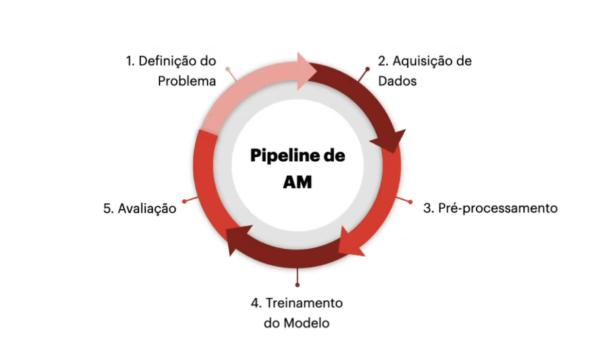
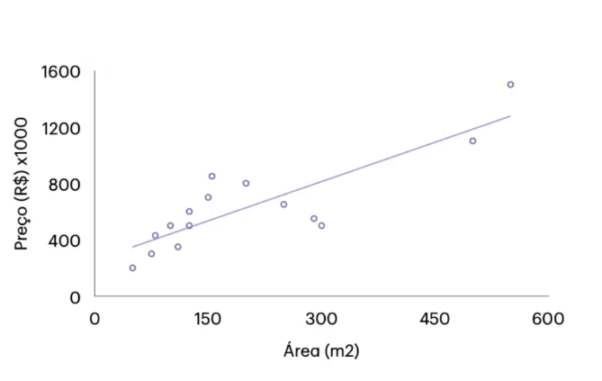
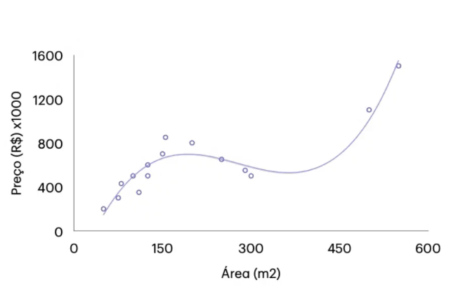
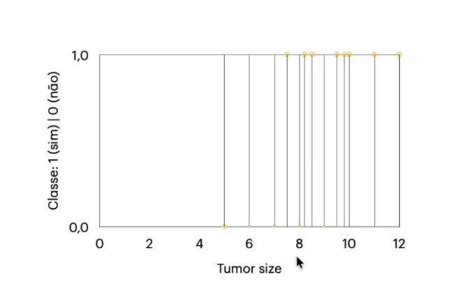
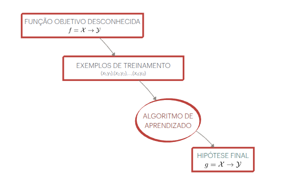
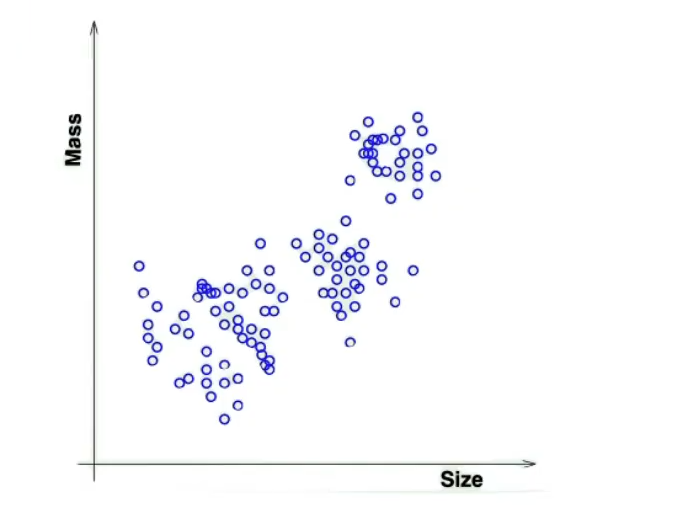
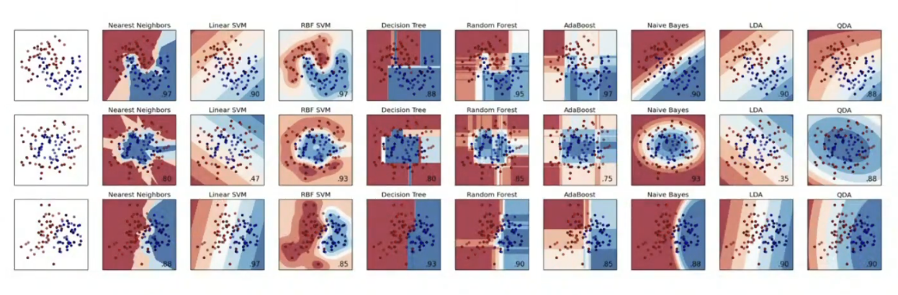
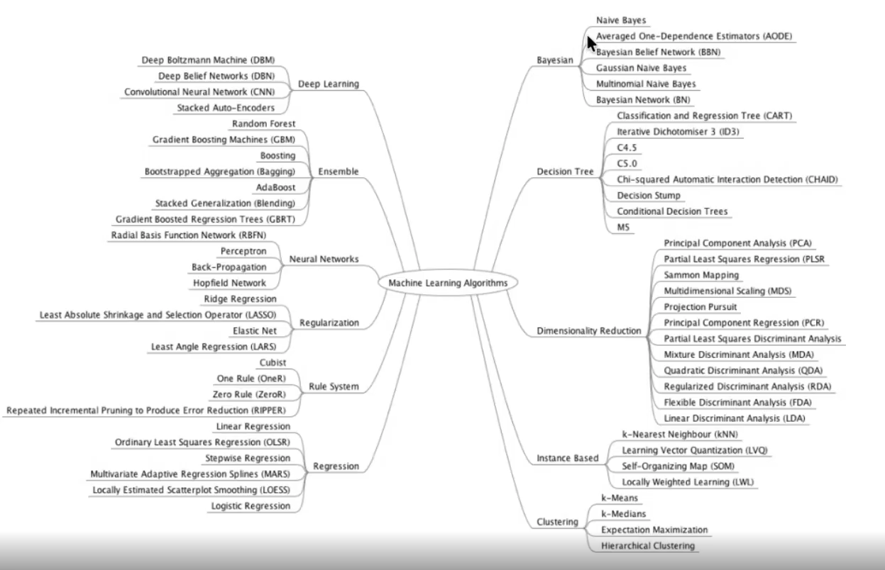
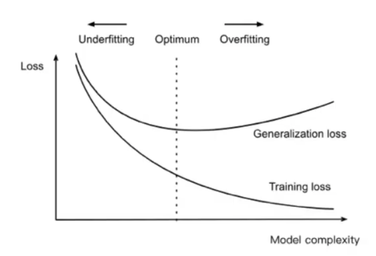
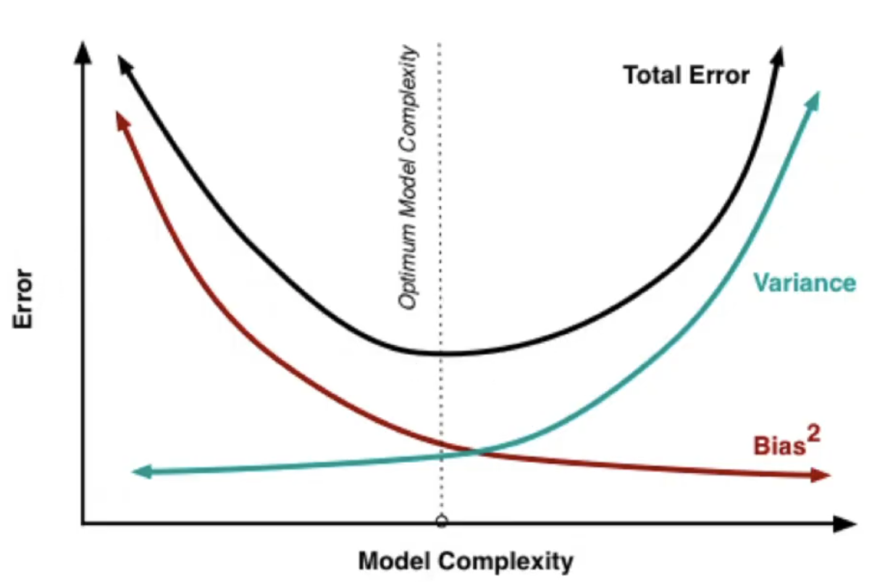

## Machine Learning

Definition: 
- Arthur Samuel (1959): "É o campo de estudo que da ao computador a habilidade de aprender sem ser explicitamente programado". 

- Tom Mitchell (1997): "O aprendizado de maquina e um campo de estudo de algoritmos que melhoram ou optimizam uma performance **P** em uma tarefa **T** com uma experiencia **E**"

    - **P**: a forma que estamos utilizando para avaliar como a tarefa esta se conseguindo se adequar;
    - **T**: A tarefa que estamos tentando fazer a predicao;
    - **E**: representa os dados e/ou informacao que o modelo esta utilizando pra aprender

### Ideia Principal
A ideia principal e que a maquina(computador) tenha capacidade de aprender a partir de dados, e nao possuir regras especificas como existiam nos modelos especialista. Modelos especialista que por sua vez eram definidos por regras e comportamentos claros, nas quais nao conseguiam se adaptar a novos cenarios, ou a novos dados. 
    
Portanto, a ideia e que esses modelos de aprendizagem no fundo, "despertem" a capacidade de se adaptar a novos cenarios e nao somente conseguir aprender
atraves dos dados que foi treinado. Mas sim aprender a generalizar para todos os cenarios com novos dados que ele ainda nao observou durante o treino por exemplo.

### Aplicacoes
- Saude;
- Financas;
- Recomendacao;
- Veiculos Autonomos;
- Visao Computacional;
- Processamento de Linguagem Natural;
- Ciberseguranca

## Pipeline de Machine Learning

Todas as etapas sao extremamente importantes, dentro do fluxo ou pipeline de um modelo de machine learning. Porem, vale destacar que as etapas `2`e `3`sao de suma importancia.

A aquisicao de dados

O Pré-processamento e muito importante porque nem sempre os nossos modelos trabalham com o mesmo tipos de dados, ou seja, eles trabalham com dados diferentes entre si, por exemplo em quando estamos trabalhando com imagens ou voz, estamos tratando de um formato de dados nao estuturado, já quando trabalhamos com dados tabulares estamos lidando com dados estruturados. 

Por exemplo, as redes neurais trabalham necessariamente com dados numericos, entao se eu tenho uma feature ou variavel categorica nos meus dados eu preciso de realizar uma serie de pre processamentos para, que tenha-se estes dados formatados da melhor maneira possivel para o modelo.

Já se pensarmos em modelos baseados em arvores, eles ja conseguem lidar com dados nominais. E se eu fizer esta fase bem feita isso pode trazer beneficios para o modelo, alem de facilitar o treinamento.

### AutoML - Automated Machine Learning
O AutoML e basicamente uma area ou um campo que ja tem embutido dentro da sua concepcao todo este ciclo de pipeline de 1 a 5, como mostrado na imagem e ele realiza isso totalmente de forma automatica, onde eles fazem a estrategia de busca de pre processamento, fazem a busca de diferentes tipos de aprendizado, fazem otimizacao dos hiperparametros. E todo esse processo e realizado de forma automatica, e uma ferramenta muito interessante para quando nao seja conhece muito qual modelo utilizar para treinar e etc.

## Exemplos basicos de aprendizado de maquina:

**"Quero construir uma maquina de aprendizado (algoritmo) que consiga prever o valor de imoveis em uma determinada regiao", uma maquina simples para resolver este problema seria o regressor linear**

Cada modelo trabalha de uma determinada maneira, entao mesmo que os dados sejam iguais e o problema seja o mesmo, modelos diferentes irao produzir saidas diferentes.
 

No Machine learning, nem sempre queremos ter o melhor modelos possivel, porque pode ser que quando eu passo pra este modelo um novo dado, ele pode nao conseguir generalizar para esta nova informacao. 

Logo, queremos um modelo que aprenda com os dados de treinamento, mas que tambem que seja capaz de generalizar para novos dados, que seja uma maquina de aprendizagem nao enviesada, ou seja, nao quero um modelo com alto overfitting, overfitting impacta
na capacidade de generalizacao, veja esse exemplo do mesmo problema de prever precos de imoveis:

**"Quero construir uma maquina de aprendizado que consiga classificar se o tumor e maligno vs nao-maligno" uma maquina simples seria um modelo linear tambem, porem para o problema de classificacao e nao regressao.**

Veja que os modelos de regressao linear, nao sao utilizados apenas para problemas de `predicao`, mas sao usados tambem para modelos de `classificacao`, ou seja ao invez de ter uma saida numerica neste caso eu tenho uma saida binaria (0 e 1)

Entao,veja a imagem abaixo:

Veja que na imagem acima, temos um problema de classificacao e se utilizarmos uma maquina de aprendizado linear e fizermos um "corte" seremos capazes de separar e classificar dado os dados se o tumor e **maligno classe 1 (sim)** ou se e **nao-maligno classe 0 (nao)**.

Porém, se fizermos outra observacao na regiao onde a variavel categorica do tamanho do tumor (Tumor Size), seja de tumores com tamanho na faixa de 8 a 12, teremos dificuldade de separar as duas classes, ou seja, neste caso a maquina de aprendizado comeca a ter problemas para classificar atraves do tumor size se e maligno: classe 1 ou se e nao-maligno classe 0. Esta, dificuldade, demonstra uma certa limitacao em relacao a variavel categorica tumor size pois representa que ela somente pode nao ser suficiente para representar nosso problema, e que se talvez tivessemos mais informacoes como sintomas da doenca por exemplo, ficaria mais simples e conseguiriamos classificar, tendo um melhor modelo. Portanto, tem problemas que conseguimos resolver com maquinas de aprendizado mais simples como, regressores lineares, porem em alguns cassos sera necessario utilizar maquinas mais complexas, entao tudo depende do problema que queremos tratar para encontrar a maquina de aprendizado que queremos.

## Quando utilizar Machine Learning?

Na verdade nao existe uma regra e pode-se utilizar machine learning, em teoria em qualquer tipo de problema. Porem, o termo mais adequado seria dizer quando e recomendado se utilizar aprendizado de maquina entao:

- Quando existe um padrao;
- Utilizo quando nao existe uma funcao que resolve o problema;
- E o mais importante e crítico a existencia de **dados**;

**E o mais importante se nestes meus dados, nao exista um padrao, ou na ha dados disponiveis e que eles nao consigam representar bem o meu problema, eu nao vou conseguir um modelo que ira aprender e performar bem.**

## Componentes do aprendizado de maquina

Imagine um problema simples de analise de credito

- Problema: Analise de credito
    

**Dados**: 

| Variaveis | Valor |
|------| ---------|
| idade | 25 anos |
| sexo| masculino|
| salario| R$5000 |
| anos na residencia | 1 ano |
| debito atual | R$ 20.000 |
| ... | ... |

### Como definir dado estes dados aprovo ou nao o credito para este cliente ?

Para isso preciso formalizar o problema:

- Entrada: $x$ - (dados do cliente);
- Saida: $y$ - (bom ou mau cliente);
- Funcao objetivo: $f = X \to Y$ - (funcao ideal);
- Dados: ($x_{1}$,$y_{1}$), ($x_{2}$,$y_{2}$),($x_{n}$,$y_{n}$) - (registros do historico);
- Hipotese: $g$ = $X \to Y$ - (funcao a ser utilizada)

#### Obs: 
- Dados $x_{1},.., x_{n}$, representam a minha coluna de variaveis: (idade,sexo,salario) e $y$ representa minha coluna de valores: (25 anos, masculino, 1 ano, R$ 5000)
- Hipotese, representa justamente o algoritmo que vai ser treinado utilizando os dados e vai me gerar como resposta a hipotese que leva $X \to Y$ ou seja, que a partir de um conjunto de variaveis ($X$) ele e um bom pagador ($Y$)

**E sendo assim, vamos utilizar uma maquina de aprendizado, e dependendo desta maquina de aprendizado ela vai utilizar a estrategia dela para obter esta hipotese.**

## Tipos de Aprendizado
1. Aprendizado Supervisionado
2. Aprendizado Nao-supervisionado
3. Aprendizado Por reforco

Estes, sao os ditos tipos de aprendizado classicos, porem existem outros que sao mesclas entre os classicos e utilizacao de tecnicas, tais como:

- Aprendizado semi-supervisionado;
- Aprendizado auto-supervisionado;
- Aprendizado online;
- Aprendizado Federado;
- Apredizado Multitarefa;
- Apredizado Multi-instancia;
- Aprendizado por imitacao;
- Meta Aprendizado;
- Aprendizado Contrastivo;
- Aprendizado por Representacao;
- Aprendizado Incremental;
---

### 1. Aprendizado Supervisionado

No aprendizado supervisionado como o proprio nome ja sugere, a ideia principal e supervisionar a maquina. Mas como supervisionar a maquina? A ideia de supervisao de uma maquina seria fornecer para ela exemplos ou rotulos (labels),sobre o que sao as coisas que ela esta tentando aprender.

Ou seja, no aprendizado supervisionado estamos tentando fazer **predicoes** com base em exemplos rotulados tendo o meu $X$ e tenho o meu $Y$ que seriam a minha entrada e minha saida desejada desse exemplo que vai estar presente no meu conjunto de dados, respectivamente.

Logo, este algoritmo vai tentar encontrar relacoes, entre os meus **atributos de entrada** ($X$) e meu **atributo alvo ($Y$)**

Dentro do **Aprendizado Supervisionado** temos dois problemas classicos:
- **Classificacao**: Neste problema a saida ou alvo ($Y$) e uma categoria ou chamado de categorico (e-mail e spam/n spam?)
- **Regressao**: Ja na regressao a saide e um valor numerico ($Y$) exemplo prever o preco de uma casa, dado o numero de quartos e o bairro.

Aqui dentro da categoria do aprendizado supervisionado podemos incluir os problemas de Series Temporais (ex: prever uma venda)

### 2. Aprendizado Nao-supervisionado

A diferenca entre o aprendizado supervisionado e nao supervisionado e justamente no que diz respeito ao alvo ou melhor dizendo a saida, pois no aprendizado nao supervisionado ao inves de ter a entrada e a saida ($X$,$Y$) eu tenho apenas a entrada ($X$) ou seja nao tenho informacao sobre a saida deseja.

Portanto, a principal estrategia utilizada por este tipo de aprendizagem e tentar criar clusteres ou regioes onde os dados de entrada ($X$) formem regioes ou grupos de alta correlacao no espaco entre as entradas e criar uma forma de separar, categorizar ou ate mesmo o termo bastante utilizado "clusterizar" estes grupos ou categorias diferentes entre estes dados.

Mas, uma grande duvida que fica quando falamos em aprendizado nao supervisionado e: **"Como eu sei que meu modelo esta aprendendo?"**

No aprendizado supervisionado, eu tenho a informacao da **saida esperada** e ja no nao-supersionado essa saida nao existe. Entao, como entender se a maquina de aprendizado esta "Aprendendo"? 

Um ponto interessante neste caso e muito comum, utilizarmos um conjunto de dados rotulado (aprendizado supervisionado) que ja conhecemos os labels, removemos a label deste conjunto de dados e infere sob o modelo nao supervisionado e a partir dai tecemos comparacoes com o valor real. Com isso e possivel avaliar a performance da nossa maquina de aprendizado se ela esta indo bem ou nao, ou seja, o quao o algoritmo foi capaz de aprender a segragar grupos em regioes categoricas ou "clusteres"

Veja um exemplo de algoritmo nao supervisionado:

### 3. Aprendizado por reforco

## Fronteira de decisao

Os algoritmos ou melhor cada algortimo tem sua fronteira de decisao ou a maneira como ele separa os dados e os classifica e etc.

Ou seja, ate mesmo dentro do mesmo conjunto de dados temos fronteiras de decisao diferentes, pois cada algortimo trabalha da sua maneira propria cada um destes algoritmos possuem vieses proprios sobre a forma de como a fronteira ou regiao de decisao diferente.

Entao se eu treinar um algortimo sempre com o mesmo conjunto e ate mesmo com o mesmos dados e mesmo algortimo ainda assim ele vai me retornar resultados diferentes, justamente por conta da presenca do vies do inerente do proprio algoritmo e com isso tentamos tambem entender com oeste algoritmo esta aorendendo veja:

### Tipos de algortimos na area de Machine Learning

Veja alguns dos muitos algortimos possiveis, para se trabalhar dentro do amplo campo do Machine Learning:

## Fundamentos da Generalizacao

A **generalizacao** ou tambem, comumente dita **capacidade de generalizacao**, e um dos principais pontos dentro da area de Machine Learning pois, ela **e o principal objetivo** dentro do campo de Aprendizado de maquina, e a meta pois o que queremos no final apos um experimento ou trabalho de machine learning e que nosso modelo generalize bem para dados fora do nosso conjunto de treinamento.

Formalmente dizendo, o que e a Generalizacao e aprender uma hipotese $g$ que generalie bem: ou seja, como dito funciona bem para dados fora do conjunto de treino.

Porem, existem erros no meio deste processo aprendizagem e nao erro humano. Quais sao estes erros:

### Tipos de erro:
 - **Erro dentro da amostra** ($E_{in}$): desempenho nos dados de treinamento;
 - **Erro fora da amostra** ($E_{out}$): desempenho desse modelo em novos dados (verdadeiro alvo);

 - Boa generalizacao: tenho um bom modelo ou generalizacao quando: $E_{in}$ $\approx$ $E_{out}$

 ## Overfiting vs Underfiting, falha da generalizacao

O overfiting e underfiting sao facilmente um dos topicos, mas falados em pequenas discussoes entre Engenherios de Machine Learning, por ser um dos topicos mais importantes porque eles atuam como especie de "sensor" que nos ajuda a entender a qualidade dos nossos modelos:

Entao, dado a teoria de generalizacao, podemos dizer que o Overfitting e Underfitting sao:

**1) Overfitting: Ocorre quando o erro dentro das minhas amostras para um dataset de treino e muito baixo. Mas o erro dentro das minhas amostras para um dataset desconhecido ou nao visto durante o treino e muito alto veja:**

 $$E_{in} \downarrow \space E_{out} \uparrow$$
 
Ou seja, eu treinei meu modelo ele foi muito bem no conjunto de treinamento, esta me dando por exemplo uma metrica de acuracia de 98%. Mas quando eu apresento pra ele uma amostra fora deste conjunto ele nao consegue fazer a classificacao da maneira correta por exemplo.

> Portanto: o modelo provavelmente esta aprendendo apenas ruido, e peculiaridades dos dados de treino e com isso ele nao tem **capacidade de generalizacao fora deste dominio (para novas amostras de um dataset desconhecido)**

---

**2) Underfitting: Ocorre quando, o erro dentro das minhas amostras para um dataset de treino e muito alto. E o erro dentro das minhas amostras para um dataset desconhecido ou nao visto durante o treino tambem e muito alto** 

Ou seja, treinei meu modelo e o resultado e tao ruim que o modelo nao e capaz por exemplo de classificar corretamente nem para minhas amostras do dataset de treino ($E_{in}$) tao pouco para novas amostras ($E_{out}$) de um dataset desconhecido ou nao visto durante o treino, logo o modelo e ruim tanto dentro das amostras de treino quanto para amostras fora do treino e isso significa portanto que o modelo nao aprendeu nada. 

>Ou seja, o modelo possui baixa capacidade de representação (ou capacidade insuficiente) para aprender os padrões dos dados.

 $$E_{in} \uparrow \space E_{out} \uparrow$$

Veja uma imagem abaixo que e um grafico muito famoso mostrando o **Tradeoff existente entre Overffiting vs Underfitting.**

---

## Tradeoff 

Existe um conceito tambem para o tradeoff onde:

- Quanto maior complexidade ($\uparrow$): melhor ajuste ($\downarrow E_{in}$)
- Mas tambem maior o risco de overfitting: ($\uparrow E_{out}$)

O que o grafico nos mostra e veja que temos um grafico de Loss x Model complexity.

No grafico e possivel visualizar duas curvas sendo elas: Training loss e Generalization loss.

- Training loss: Representa o $E_{in}$ erro no dataset de treino;
- Generalization loss: Representa o $E_{out}$ erro em um novo dataset

Um aspecto importante a se observar e que o grafico mostra que mesmo que temos um modelo complexo, para um novo dataset o erro ainda e alto veja que a curva de **Generalization loss** esta com um alto valor de **loss** e ja a training loss mostra uma baixa loss.

Portanto, o objetivo e encontra um ponto de optimalidade onde tenhamos um bom equilibrio entra a Loss e a complexidade do modelo.

Toda essa ideia, culmina em um dos conceitos mais importantes dentro do estudo de Machine Learning, que e o **Tradeoff Vies-Variancia**

## Tradeoff Vies-Variancia

- Vies (Bias): E basicamente um erro de aproximacao, ocorre quando meu modelo e muito simples;

- Variancia: E basicamente um sensibilidade ao conjunto de dados, ocorre quando meu modelo e muito complexo;

 

Vamos entender o grafico que atraves dele entenderemos melhor o conceito do Tradeoff Vies-Variancia

Veja que no grafico temos duas curvas, a curva na cor vermelha representacao o vies(bias) e a curva ciano, representando a variancia. 

Logo quando observamos o grafico e possivel ver que quando tenho: 

> **1) Quando alto valor de vies, tenho baixa variancia**.

Ja quando eu tenho:

> **2)Alta variancia, tenho um baixo vies**

Para entendermos melhor ainda, se observarmos o grafico possui uma linha pontilhada, praticamente no centro do grafico. Aquele e ponto otimo onde temos o equilibrio entre complexidade e erro consequentemente o ponto de optimalidade entre vies vs variancia.

Um outro detalhe a se observar e que ele separada o grafico em podemos dizer a grosso modo "lado esquerdo" e "lado direito".

No lado esquerdo temos o comportamento do item `1` onde mostra que se:

> Quando a complexidade do modelo e baixa eu tenho baixa variabilidade mas posso ter um alto vies.

No lado direito temos o comportamento do item `2` onde mostra que:

> Quando a complexidade do modelo e alta eu tenho uma alta variabilidade e um baixo vies.

**Portanto, atraves disso podemos tecer algumas afirmacoes se o modelo tiver alta complexidade significa que ele teoricamente tem uma melhor generalizacao e tem um baixo vies, nao e enviesado ele nao decorou as dados de treino, mas ainda varia muito e a complexidade tambem sobe demais e pode ser que chegue um ponto que por mais ele tem potencial de generalizacao e aprendizado ele pode ter problemas devido a complexidade do modelo sendo muito sensivel a novos dados. (overfit)**

**Ja quando o modelo tem baixa complexidade da pra perceber que ele tem uma baixa variancia, ou seja, em teoria tem um menor potencial de generalizacao, e tambem te um alto vies que em teoria demonstra que o modelo esta decorando os dados de treinamento e que tem dificuldades quando encontra um dataset desconhecido logo ele nao e um bom modelo, e como se o modelo nao tivesse aprendido nada (underfit)** 

Concluindo, uma ultima observacao e que no lado direito podemos dizer que o modelo tem a tendencia de estar entrando em overfit. Ja no lado esquerdo o modelo tem a tendencia de estar entrando em um cenario de underfit.

Precisamos tambem estar sempre atentos a correlacao existente entre os dados versus a complexidade do modelo entao se eu tenho um dado muito simples porem dataset de alta complexida, provavelmente meu modelo entrara em overfit.
