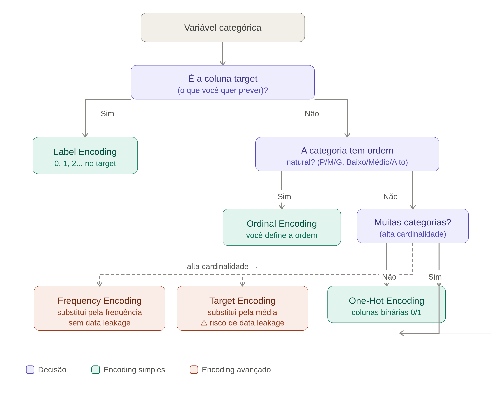

# Tecnicas de processamento de dados

## Agenda
- Encoding
- Normalizacao (Standardizacao)
- Maldicao da dimensionalidade
- Desbalanceamento dos Dados

## Introducao

Boa parte dos modelos/ algortimos de Machine Learning sao construidos tendo em mente que iremos tabalhar com valores numericos, ou seja variaveis numericas. Mas existem tambem modelos que trabalham com valores categoricos como e o caso das arvores de decisao. Mas no geral os modelos operam com valores numericos.

Entretanto, e muito comum que os nossos conjuntos de dados, possuam variaveis categoricas. 

### Variavel categorica
Uma variavel categorica e basicamente o que a ideia ou  o proprio nome sugere. E basicamente uma categoria, nome, que confere caracteristica a um grupo.

Exemplo:

Imagine que eu tenha um conjunto de dados referente a informacoes de sobre alunos do curso de Engenharia Eletronica da Universidade Federal de Uberlandia este dataset e o seguinte:

| Nome | Coeficiente de rendimento | Salario apos formado| 
|---|---|---|
| Joao Victor | 80.0 | Medio  |
| Otavio Ribeiro | 50.0 | Baixo |
| Matheus Andrade | 92.0 | Alto |
| Gabriel Rocha | 49.0 | Baixo|
| Alfredo Mancedo | 95.0 | Alto |

Portanto, a coluna **Salario apos formado**, sera uma coluna, feature categorica ou comumente chamada de variavel categorica. Isso se deve pois ela atribui as amostras de cada individuo do dataset a uma categoria que de salarios, sendo esta coluna **salario** dividida em: alto,medio e baixo.

Logo, se quisermos trabalhar com variaveis categoricas, normalmente os valores de cada indiviuo sao do tipo string e portanto sera necessario ou uso de uma tecnica de `encoding` para transformar a variavel categorica (string) em uma variavel numerica (float).

### Escalas

Um outro fator que nos leva a pensar em relacao aos nossos dados se da pela famosa escala dos dados. Como vimos no kNN a escala do dataset deve ser algo de muita atencao pois diversos modelos sao extremamente sensiveis a escala. Como e o caso do kNN onde a escala de maior magnitude cria um vies no modelo e isso faz com que o modelo tenha seu aprendizado distorcido e neste caso o aprendizado fica limitado ou comprometido resultando em um modelo "nao aprende". Sendo assim, **para resolver este problema se faz necessario o uso de tecnicas de normalizacao dos dados antes do treinamento do modelo**

### Maldicao da dimensionalidade

Quando se tem muitas features/atributos (diversas colunas), o espaco de dados(dataset), fica muito espalhado(esparso), isso ocasiona um custo computacional muito grande,alem de atrapalhar o aprendizado do modelo.

Para resolver este problema, existem algumas estrategias para reduzir a dimensionalidade e uma das mais famosas e o PCA (Principal Component Analysis) **tecnica de aprendizado nao supervisionada que consiste em reduzir a dimensionalidade preservando a variancia**. 

Existe tambem o irmao do **PCA** que e o **LDA** que basicamente e uma estrategia de aprendizado supersionado tambem para realizar a reducao da dimensionalidade porem levando em consideracao nao somente as colunas do dataset mas tambem os rotulos, e tentar resolver o problema da maldicao da dimensionalidade.

### Desbalanceamento dos dados

Um outro problema bem grave que encontramos nos dados e o desbalanceamento de dados que se caracteriza quando temos um problema de classificacao em que uma classe esta menos representada do que outra onde a classe 1 tem mil exemplo e classe 2 tem 50 exemplos e isso pode ocasionar prejuizos no aprendizado do modelo e existem estrategias para se tratar esse desbalanceamento a nivel de pre-processamento de dados. Mas tambem existem estrategias a nivel de algortimo

> "Gabage in, gabage out" Essa frase nos remete a uma das ideias mais relevantes dentro de machina learning. Que basicamente e que a qualidade dos dados de entrada limita a qualidade do modelo, principalmente para aqueles sensiveis e se preparamos melhor os dados para estes modelos teremos melhore resultados.

## Encoding de variaveis categoricas

Como falamos, boa parte dos modelos de machine learning nao conseguem lidar com variaveis categoricas, pois a maioria deles lidam com variaveis numericas.

Entretanto, quando vamos utilizar o encoding que e um processo que visa transformar variaveis categoricas em variaveis numericas, nao podemos so simplesmente sair atribuindo numeros aleatorios diretamente como por exemplo 1,2,3.., pois pode gerar um problema ainda maior chamado de falsa ordenacao.

Porem em alguns contextos a ordem pode fazer sentido mas precisa-se tomar cuidado ao realizar este tipo de ordenacao.

Sendo assim, para realizar o encoding de maneira correta seguindo uma padronizao, existem tecnicas para fazer isso e as principais tecnicas utilizadas sao o **One-Hot Encoding** e o **Label Encoding**

> O **One-Hot encoding** e utilizado justamente quando nao temos uma ordem nas variaveis categoricas

> O **Label encoding** e um encoding simples onde ele considera que exista um certa ordem nas variaveis categoricas

### Label Encoding

Certo, vimos que o label encoding ele considera que ja existe uma certa ordem nas variveis categoricas porem como se aplica na pratica?

> No Label encoding, transforma-se cada categoria em um numero inteiro

Exemplo:

|Cidade|Label|
|---|---|
|San Francisco | 0 |
|New York | 1 |
|Seattle | 2 |

Veja no exemplo acima que se transforma a feature **Cidade** contendo 3 amostras de cidades aleatorias dos estados unidos. Logo, quando se utiliza a  tecnica de LabelEncoding a coluna **Label** agora se tornou numeros 0,1,2.

Nesse contexto, e possivel ver que nao ha necessidade de se ter uma ordem porque sao cidades aletorias dos estados unidos de diferentes estados, ou seja, qualquer uma das 3 cidades poderiam receber qualquer valor 0, 1 ou 2.

E possivel compreender que nao ha necessidade de ter ordem a nao ser que se esteja analisando a quantidade de habitantes por cidade por exemplo.
 
Sendo assim, neste caso seria necessario que a cidade com maior numero de habitantes recebesse a maior categoria.

> Logo, justamente por este motivo que o LabelEncoding nao e tao adequado, ele induz uma falsa ideia de ordem que nao existe, visto que ele atribui 0,1,2 e isso pode acabar ocasionando um problema pro modelo pois ira colocar um peso maior na categoria Seattle - 2, entendendo que ele e maior por exemplo

Veja agora um outro exemplo que faria sentido ter esta ordem e utilizar-se o Label Encoding

Exemplo:

|Cliente|Risco|Risco(numerico)|
|---|-------|---|
| A | Baixo | 0 |
| B | Medio | 1 |
| C | Alto  | 2 |
| D | Medio | 1 |

 Ja neste caso, e possivel perceber que ha uma relacao entre o valor de risco veja que o **Cliente A** tem risco **baixo** entao ele recebe apos o processo de **LabelEncoding e rotulo 0**, depois o cliente com o **risco medio** recebe o **rotulo 1** e por fim o **cliente C** recebe o **rotulo 2**

 Entao neste caso e bastante recomendavel que se utilize o LabelEncoding que ira gerar o seguinte:

 - Risco baixo : 0
 - Risco Medio : 1
 - Risco Alto : 2

Veja entao que existe uma ordem onde o **risco alto** recebe um **maior valor** **2** ja **risco baixo** recebe **um menor valor** **0**  e de fato faz todo sentido pois para esta aplicacao **e necessario que o risco alto receba um maior peso para o modelo**. Logo, este e um excelente exemplo de quando usar o LabelEncoding

### One-hot encoding

Ja para quando nao existe uma ordem propriamente dita o mais adequado e que se utilize justamente o One-hot encoding pois como nao ha ordem teoricamente nao enfretaremos problemas semelhantes aos que ocorrem no LabelEncoding.

Certo mas de fato o que e o **One-Hot Encoding** ele nada mais e que um grupo de `bits` onde cada bit, representa uma categoria possivel. Se a variavel nao puder pertencer a varias categorias ao mesmo tempo, apenas um bit do grupo podera estar "ligado"

> Certo mas como isso e na pratica ?

Vamos utilizar um exemplo. Tenho 3 cidades: San Francisco, New York e Seattle, uma ideia ingenua seria pegar e atribuir um valor numerico aleatorio parecido como fazemos no `LabelEnconding` porem note que neste caso a ordem pode impactar no modelo, pois ordenar de maneira aletoria pode fazer parecer que Seattle e maior que San Francisco ou melhor pra trablho e etc. Entao, aqui dependendo do dominio em que estamos trabalhando em um modelo nao podemos simplesmente fazer isso. 

Portanto, justamente para resolver este problema temos o `One-Hot Encoding`. Como ele funciona na pratica? criaremos uma coluna para cada cidade. onde chamaremos de: `e1`,`e2`,`e3` (encoding)

|Cidade|e1|e2|e3|
|---|-------|---|----|
| San Francisco | 1 | 0 | 0 |
| New York |0| 1 | 0 |
| Seattle | 0 | 0 |  1|

Lembre-se que o One-Hot Encoding, cada bit representa uma categoria possivel entao em uma linha por exemplo onde eu tenho um registro ou um dado de um dataset que possui algo parecido com 1, 0, 0 significa que provavelmente aquele individuo pertecente a categoria `San Francisco` ou melhor dizendo onde se tem o bit 1 na coluna e1, entao ele e da categoria 1. Se tiver bit 1 na coluna e2 entao categoria 2 ou bit na coluna 3 representa pertencente a categoria 3. E assim fica simples para o modelo.

Porem, o One-Hot encoding tem um prboblema que sao variaveis de alta dimensionalidade(problema da maldicao da dimensionalade). ou features com muitas categorias imagine ter 500 categorias teriamos uma quantidade muito alta de colunas de enconding de `e1`,..,`e2`,... `e500`, isso fica muito caro computacionalmente e gera problemas serios pro meu modelo.

Quando nos deparamos com estes problemas com features com muitas categorias, podemos utilizar algumas abordagens alternativas de Encoding sendo: `Frequency encoding`, `Target encoding`

Essas abordagens sao simples, porem muito uteis. O **Frequency Encoding** basicamente faz o que o nome diz, ele verifica a frequencia que a determinada categoria analisada aparece no dataset

Quando e interessante utilizar o **Frequency Encoding** quando nao dar pra utilizar os mais simples ou seja LabelEncoding e One-Hot encoding, ou quando temos features com muitas categorias tambem chamado de alta cardinalidade ou tambem quando a frequencia e relevante para o modelo.

O **Target Encoding** faz algo parecido mas ele pega a quantidade de aparicoes daquele inidividuo do dataset e tira uma media da aparicao da categoria para aquele individuo veja:

|Cidade|Registros|Media do Risco|
|---|-------|---|
| San Francisco | [1,0,1] | 0.67 |
| New York | [0,0,1,0] | 0.25 |
| Seattle | [1,1]  | 1.0 |

> Quando usar cada tipo de encoding?
De maneira geral, utilizar estas estrategias alternativas e interessante como visto quando temos uma alta cardinalidade(alta numero de categorias para um mesmo individuo) ou quando nao existe uma ordem pre definida

Alem do que vimos ate aqui uma boa maneira de se guiar para entender qual tipo de Encoding utilizar podemos consultar uma especie de arvore mental a seguir:

## Normalizacao de dados (Scaling)

> O que e o Scaling?

E um processo importante que vista ajustar as variaveis de um conjunto de dados para que todas tenham escalas comparaveis

> Porque e importante o uso?

Pois utilizar a normalizacao permite com que evitemos que atributos com valores muito grandes dominem o processo de aprendizem e tornem o modelo overfitado/enviesado. Esse tipo de abordagem e intressante tanto para **classificacao** quanto pra **modelos de regresso**., alem de ser extremamente util tambem para modelos como o KNN 

### Tecnicas de scaling (normalizacao/escalonamento)
O uso das tecnicas de **Scaling** e um tema central no Machine Learning. O nome normalizacao vem da ideia de que quando voce aplica o Z-score, os dados tende a seguir uma distribuicao normal(**com media = 0 e desvio padrao 1**). Ja a ideia de se utilizar e melhorar os dados para que o modelo nao tenha vieses para numeros grandes. Sendo assim, temos duas tecnicas muito famosas:

- `Standard Scaler` (Z-score)
    - Centraliza os dados em media de 0 e desvio padrao 1
    - Otimo para dados normalmente distribuidos
- `Min-Max Scaler`
    - Escala os atributos para um **intervalo fixo normalmente entre 0 e 1**
    - Preserva a forma da distribuicao, mas sensivel a outliers

**A escolha da estrategia de Scaling pode impactar de maneira severa problemas de classificacao**

> Existe um artigo muito bacana onde o author se comprometeu a fazer um experimento com 5 ou 6 tipos de estrategia de Scaling e ele mostra isso para diferente tipos de maquinas de aprendizagem. (Decision Tree, KNN, ML e etc)

A conclusao que se teve deste artigo e que a escolha de um bom Scaling melhorou muito a qualide do modelo final

Nota: Sera que a estrategia melhora entao os dados, o dataset fica melhor distribuido? melhora a fronteira de decisao ?

Agora vamos entender um pouco da parte matematica do **Standard Scaler (Z-score)**

$$ x_i = x_i - \frac{x_i - \overline{x}}{s} $$

$$ Z = \frac{X_i - \overline{X}}{s_x} $$

Onde:
- $x_i'$ = valor ja escalado;
- $x_i$ = valor do atributo;
- $\overline{x}$ = media do atributo x;
- $s$ = Desvio padrao;

Ja o **Min-Max** scaler temos:

$$ x_i' = \frac{x_i - x_{min}}{x_{max} - x_{min}} $$

Onde:
- $x_i'$ = valor ja escalado;
- $x_i$ = valor do atributo;
- $x_{min}$ = menor valor do atributo;
- $x_{max}$ = maior valor do atributo;

## Maldicao da Dimensionalidade
O problema da dimensionalidade surge considerando as muitas variaveis preditoras que podem existir no conjunto de dados. Em outra palavras quando tenho um numero exagerado de features no meu dataset.

Porque isso e um problema de fato? Imagine que temos muitas features ou muitas variaveis preditoras, teremos um **espaco de variaveis preditoras estupidamente grande**, isso faz com que o **espaco de busca** aumente de maneira exponencial a quantidade de dimensoes ou seja isso sera um grande problema.

Alem disso, um outro aspecto muito importante: e **quanto maior for o numero de variaveis no meu espaco de busca, maior sera a chance dos modelos serem invalidos ou pouco generalizaveis**.

Um pesamento bastante inocente, e corriqueiro e que quando mais informacao ou seja quanto maior for o numero de variaveis no meu dataset, o modelo ira aprender melhor porem isso nem sempre e verdade. Na realidade, isso pode piorar o modelo por muitos motivos por exemplo: 

O excesso de variaveis pode tornar o espaco de caracteristicas muito amplo e isso pode acabar atrapalhando a interpretabilidade. Alem disso, a alta dimensionalidade aumenta a complexidade do modelo.

Se considerarmos por exemplo um KNN ele nao ira conseguir ser executado para esta alta dimensionalidade. felizmente existem estrategias para reduzir esta dimensionalidade que veremos a seguir.

### Principais impactos
Um dos principais impactos ou "sintomas" que se e notado logo de inicio em situacoes onde temos uma **alta dimensionalidade** e a necessidade de mais dados de treino para que se obtenha bons modelos.

Por exemplo se eu tenho um dataset com muitas colunas, sera necessario ter muitas linhas para que tenhamos um dataset suficientemente representativo.

Maquinas de aprendizagem nao parametricas, ou **metodos nao parametricos** tais como `instance-based learning` e `arvores de decisao`, sao extremamente impactados, como normalmente estas maquinas de aprendizagem nao sao treinadas e funcionam por busca no espaco de dados ou acumulo de dados como o KNN, estes a medida que a dimensionalidade do espaco de variaveis cresce a quantidade de exemplo ou seja o tamanho do dataset **cresce tambem de maneira exponencialmente**

Felizmente, para isso podemos utilizar estrategias para **selecao de features**, e de **reducao de dimensionalidade**.

### Reducao de dimensionalidade - Principal Component Analysis (PCA)

> Objetivo: Gerar um novo conjunto de variaveis menor do que o conjunto original e que retenha o maximo de **informacao** do meu conjunto de dados

Neste caso, **informacao** aqui representa variacao presente na base de dados original em relacao a nova.

> Ou seja queremos gerar um novo conjunto de variaveis menor, mas que preserve a informacao ou seja, queremos perder a menor quantidade de informacao do dataset original

Estas variaveis criadas pelo PCA, as novas variaveis elas sao nao correlacionadas

O motivo de elas serem ditas nao correlacionadas e possivel de compreender observando o grafico abaixo, veja:

- pontos em azul representam os dados;
- retas pretas representam as componentes principais (representam duas variaveis);
- Vamos tentar converte-las em uma unica

Veja que no exemplo da imagem temos duas componentes, em direcoes diferentes, portanto como suas componentes vetoriais estao em direcoes diferentes isso mostra que nao existe correlacao entre elas.

Considerando os dados ponto em azul e a reta com cor escura, que representa a componente principal que vai ser selecionado se considerarmos apenas uma componente principal ele sera o componente principal que melhor ira representar os dados que e justamente quando ele se encaixa na linha com tracejado rosa.

### PCA

- **Os novos eixos**: Serao criados sao combinacoes lineares dos eixos originais, que serao selecionados pela variancia (quantidade de informacao) que este novo eixo carrega

- **Componentes principais**: 
- O numero de componentes principais e = numero de variaveis originais.
- A maior parte da informacao vai se concentrar em poucos componentes
- Obtem-se boa representacao em baixa dimensao
- Nao ha perda de informacao; os dados originais podem ser reconstruidos.

Esta e a ideia principal para que seja possivel ter uma baixa dimensionalidade dos dados sem ter perda significativa de informacao.

> OBS: Pode-se reconstruir os dados apenas se recuperarmos todas as componentes principais, mas essa nao e a ideia do PCA

### Revisao de conceitos uteis para o PCA (Nao supervisionado)

Vamos relembrar algumas tecnicas e/ou medidas estatisticas basicas que serao de extrema importancia para calcularmos e encontrar o PCA, mas lembrando que possuimos o LDA que e o irmao do PCA para metodos supervisionados.

**Media**: Valor medio dos padroes das amaostras, pode ser calculado como sendo:

$$\bar{X} = \frac{\sum_{i=1}^{N} x_i}{N}$$

**Desvio padrao**: Medida de dispersao das amostras pode ser calculado como sendo:

$$ s = \sqrt{\frac{\sum_{i=1}^{n} (X_i - \bar{X})^2}{n - 1}}
$$

**Variancia**: E uma medida estatistica que nos fornece o quao distante da media uma dada amostra em uma populacao ou espaco amostral esta normalmente e aplicado a uma variavel. Em alguns literaturas tambem e dito que a variancia mostra como uma unica variavel sozinha varia e pode ser calculada como sendo:

$$ Var(X) = \frac{\sum_{i=1}^{n} (X_i - \bar{X})^2}{n - 1} $$

**Covarianca**: E uma medida muito parecida com a Variancia, porem a covariancia nos fornece a direcao da relacao linear entre duas variaveis diferentes, porem veja um ponto importante a observar e que a Covariancia fornece apenas a direcao e nao a forca entre esta relacao linear, ela pode ser calculada como sendo:

$$ Cov(X,Y) = \frac{\sum_{i=1}^{n} (X_i - \bar{X})(Y_i - \bar{Y})}{n - 1} $$

**Matriz de covariancia**: A matriz de covariancia nada mais e que uma matriz com valores de covariancia das variaveis(vetores) de um determinado conjunto de dados onde esta matriz e sempre uma matriz quadrada simetrica (mxm). Sendo `m` o numero de caracteristicas do padrao ou seja m e o numero de caracteristicas ou variaveis.

$$
C = \frac{1}{M} \sum_{j=1}^{M} (X_j - \bar{X})^T(X_j - \bar{X})
$$

$$C = \begin{bmatrix}
Cov(x,x)  & Cov(x,y) & Cov(x,z) \\
Cov(y,x)  & Cov(y,y) & Cov(y,z)  \\
Cov(z,x)  & Cov(z,y) & Cov(z,z)   \\  
\end{bmatrix}
$$

O PCA nos auxilia em uma serie de tarefas:
- Diminuicao do custo computacional;
- Diminuicao dos dados do espaco;
- Caso seja desejado visualizar os dados em 2D, o PCA tambem e muito util para podermos visualizar a distribuicao dos dados;

### Autovalores e Autovetores

O papel aqui dos autovalores e autovetores e o de representar os vetores base do novo espaco vetorial que melhor representa os dados originais.

**Normalmente os autovalores e autovetores sao vetores ortonormais, onde os autovalores representam a quantidade de informacao presente em cada autovetor e ja os autovetores representa a dimensao do novo espaco vetorial** 

## Algoritmo PCA passo a passo

A primeira coisa que devemos fazer ao identificar que vamos precisar de utilizar o PCA e tentar de alguma maneira entender os dados, ou seja fazer a limpeza dos dados verificar se nao existem dados faltantes e ter um conjunto de dados mais **Tidy like** "(arrumadinho)"

Alem disso, acho que um dos passos mais importantes e garantir que os dados estejam na mesma escala sendo assim e daqui que iremos iniciar veja

1. **Padronizacao dos dados: Para realizar a padronizacao dos dados vamos utilizar a tecnica de `Standard Scaling` ou o famoso Z-score.**

Apenas para fins didaticos, vamos simplificar o conjunto de dados e suponha que o conjunto de dados recebido foi:

|X|Y|
|---|---|
| 10  |  20  |
| 15  |  25  | 
| 20  |  30  | 
| 25  |  35  | 
| 30  |  40  | 

Vamos entao calcular o `Standard Scaling`, relembrando a equacao teremos:

$$ Z = \frac{X_i - \overline{X}}{s_x} $$

Calculado, ou melhor dizendo garantido que os dados estejam todos padronizados vamos entao agora, partir rumo ao segundo passo

2. **Construcao da matriz de covariancia**

A cosntrucao da matriz de covariancia pode feita atraves do calculo utilizando a seguinte equacao:

$$
C = \frac{1}{M} \sum_{j=1}^{M} (X_j - \bar{X})^T(X_j - \bar{X})
$$

3. **Calculo dos autovalores e autovetores**

4. **Escolhem-se os `K` autovalores com a maior quantidade de informacao associada**

    - Os autovalores associados expressam a quantidade de informacao;

5. **Monta-se a matriz de projecao **P** baseado nos autovetores selecionados previamente:**

$$ P = [e_1 \space e_2 \space \cdots \space e_k] $$

6. **Projeta-se a imagem normalizada obtida na etapa 1 pela matriz de projecao produzida na etapa 5. como sendo:**

$$ Z_j = (X_j - \bar{X}) \cdot P $$

7. **Desta forma o novo vetor $Z_j$ de dimensao $K$ sera a nova representacao do padrao original $X_j$**

### Exemplo: Toy problem

---

## Desbalanceamento dos dados - imbalance problem

O que e o desbalanceamento dos dados ? 

O desbalanceamento de dados, ou imbalance problem e quanto em um dado conjunto de dados eu tenho a presenca de uma grande quantidade de dados de uma classe (classe majoritaria)e pouco exemplos da outra. Observando de uma outra otica o imbalance problem pode ser descrito como sendo um problema onde em um dado conjunto de dados se tem uma baixa quantidade de dados de uma determinada classe (classe minoritaria) e uma alta quantidade de dados de outra. Ou seja, veja que em ambos os casos, temos um problema de desbalancamento pois no primeiro caso temos muitos exemplos de uma determinada classe e ja no segundo caso temos o contrario uma baixa quantidade de classe. Tudo isso, ira impactar diretamente o treinamento do modelo pois uma vez que tenho um alta quantidade de dados isso ira enviesar o modelo e fara com que o modelo tenha a tendencia de observar apenas a classe majoritaria ou vice verse, e isso ocasiona um modelo com baixo poder de generalizacao, consequentemente um modelo de baixa qualidade "pouco confiavel"

> Cause vies para classe majoriatria

Existem estrategias a nivel de dados que conseguem fazer um aumento nos meus dados minoritarios ou uma diminuicao dos meus dados majoritarios

- **Udersampling:** Criam um subconjunto de conjunto de dados original eliminandos instancias geralmente instancias da classe majoritaria

Entao no final resumidamente o que o udersampling faz e "jogar fora" da classe majoritaria uma quantiadde de dados ate que ambas as classes tenham a mesma quantidade de rotulos ou que se tenham o melhor equilibrio de exemplos possiveis como ilustra a imagem temos a inicialmente uma numero de exemplos muitor maior da classe 1 do que da classe 0. Apos o processo de undersampling podemos ver que temos a mesma quantidade.

- **Oversampling:** Criam um superconjunto do conjunto de dados original replicando algumas instancias ou criando novas instancias a partir das existentes

Entao, o que o oversampling faz no final das contas e duplicar dados ja existentes ate que se tenha uma quantidade de dados iguais tanto da classe 1 quanto da classe 2. Veja nao existe uma criacao de dados, ele nao cria propriamente dito dados novos, o que e feito e apenas a duplicacao destes dados.

Tanto o metodo de `undersampling` quanto `oversampling` ambos acabam podendo causar potenciais problemas para o meu modelo, e acabam nao sendo tao utilizados na pratica na atualidade, pois podem gerar um problema na fronteira de decisao por exemplo uma vez que eu removo dados, alem de estar tendo perda de informacao estou atrapalhando a fronteira de decisao, neste sentido o modelo pode ter apresentar metricas ainda piores. Alem disso, se estes pre-processamentos, nao forem feitos de maneira correta podemos ter cenarios de **Data Leakage** ou vazamento de dados, onde como tenho dados duplicados o meu conjunto de validacao, pode ter os mesmos exemplos que possui no dataset de treino, isso enviesa e o modelo gerado basicamente estara "decorando" e acertando porque decorou e nao porque tem capacidade de generalizacao ou porque consegue inferir para novos exemplos.

**Na pratica** o que ainda hoje se utiliza sao os metodos hibridos, pois combinam as duas abordagens de amostragem ou seja, Undersampling e Oversampling um exemplo de tenica que e uma das mais utilizadas para cenario de imbalance problem e o SMOTE (Synthetic Minority Over-sampling Technique)

O que basicamente o **SMOTE** faz? considere o exemplo a seguir: 

O SMOTE opera da seguinte maneira dado um conjunto de dados, imgine que eu tenho neste dataset simples duas classes uma classe de simbolos redondos e uma classe de simbolos quadrados, entretanto eles estao com problemas de balanceamento. O SMOTE ira aplicar um KNN, para verificar os K vizinhos proximos, entao vamos supor que alguem achou interessante utilizar `k = 4` ou seja 4 vizinhos proximos, entao o SMOTE ira verificar a distancia entre estes vizinhos e criara um elemento ou um exemplo que fornece a distancia mais proxima destes **k** vizinhos proximos, veja:

Entao veja que no topo da imagem mostrada acima ele escolhe um **k=4**, veja que temos 4 "quadrados" amarelos e ele calcula distancia e posicina um quadrado verde bem no centro do encontro destes 4 quadrados.

> Existem bibliotecas que lidam com o imbalanced learning uma das famosas e a imbalanced learning que esta dentro do "guarda chuva" do sckit-learn

Link: [Imbalanced learning](https://imbalanced-learn.org/stable/references/generated/imblearn.over_sampling.SMOTE.html)

